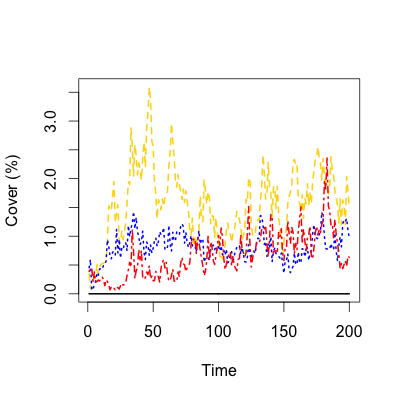

# Demographic stochasticity in IPMs

Example code for estimating covariance between size-classes. Based on equation 10.2.5 in Steve's book:

$$
Cov[n_{i}(t+1)n_{j}(t+1)] = -h^{2} \sum_{k} n_{k}(t)P(z_{i},z{k})P(z_{j},z{k})
$$

where, $P()$ is the survival$\times$growth kernal. Note that in the function below, the line `pairs$multi <- pairs[,1]*pairs[,2]*pop_vector` corresponds to $n_{k}(t)P(z_{i},z{k})P(z_{j},z{k})$ for a single column *k*.

The function for generating the correlated poisson vector is from http://arxiv.org/pdf/0710.5670.pdf.

### Proposed functions
Here are the proposed functions to calculate the covariance matrix for *P()* and for generating the correlated poisson vector based on that covariance structure:

```{r covcode, eval=FALSE}
####
##  Define a function that returns P(z_{i},z{k})*P(z_{j},z{k}) for all i,j combos
####
# X is one column (k) of the survivalXgrowth kernal
# pop_vector is the population vector whose elements are actual numbers of individuals

##  This function expands the P matrix to get all pairs of i and j
get_pairs <- function(X, pop_vector){
  pairs <- expand.grid(X, X)
  pairs$multi <- pairs[,1]*pairs[,2]*pop_vector
  return(pairs$multi)
}  

##  This function takes the P.matrix, runs it through `get_pairs`
##    and then calculates the covariance structure.
get_cov <- function(MAT){
  test <- apply(MAT, MARGIN = 2, FUN = "get_pairs", 
                pop_vector=(nt[[doSpp]]))
  mat_dim <- sqrt(dim(test)[1])
  test <- as.data.frame(test)
  test$tag <- rep(c(1:mat_dim), each=mat_dim)
  cov_str <- matrix(ncol=mat_dim, nrow=mat_dim)
  for(do_i in 1:mat_dim){
    tmp <- subset(test, tag==do_i) #subset out the focal i
    rmtmp <- which(colnames(tmp)=="tag") #get rid of id column
    # Sum over k columns
    cov_str[do_i,] <- (-h[doSpp]^2) * apply(tmp[,-rmtmp], MARGIN = 2, FUN = "sum")
  }
  diag(cov_str) <- 1 #set diagonals to perfect correlation
  return(cov_str)
}

####
##  Function for generating correlated poisson with covariance structure
####
# p = the dimension of the distribution (length of pop vector)
# samples = the number of observations
# R = correlation matrix (p X p)
# lambda = rate vector (p)
GenerateMultivariatePoisson<-function(pD, samples, R, lambda){
  normal_mu=rep(0, pD)
  normal = mvrnorm(samples, normal_mu, R)
  pois = normal
  p=pnorm(normal)
  for (s in 1:pD){pois[s]=qpois(p[s], lambda[s])}
  return(pois)
}
```

### Example in IPM context
Here is a little example as it would occur in the IPM. In the code below, I am assuming a bit of familiarity, but note that `v` and `u` are both the population vector, `rpa` is the number of recruites per area, and `muWG` and `muWS` are the estimated crowding effects.
```{r ipm_ex, echo=TRUE, eval=FALSE}
####
##  Iteration matrix functions
####
# The iteration matrix is decomposed into the survivalXgrowth kernel (P)
#   and the recruitment kernel (R).

# Get recruitment values from regression
make.R.values=function(v,u,Rpars,rpa,doYear,doSpp){
  f(v,u,Rpars,rpa,doSpp)
}

# Get survival and growth values from regression
make.P.values <- function(v,u,muWG,muWS, Gpars,Spars,doYear,doSpp){ 
  S(u,muWS,Spars,doYear,doSpp)*G(v,u,muWG,Gpars,doYear,doSpp) 
}

# Turn the values into iteration matrix
make.P.matrix <- function(v,muWG,muWS,Gpars,Spars,doYear,doSpp) {
  muWG=expandW(v,v,muWG)
  muWS=expandW(v,v,muWS)
  P.matrix=outer(v,v,make.P.values,muWG,muWS,Gpars,Spars,doYear,doSpp)
  return(h[doSpp]*P.matrix)
} 
make.R.matrix=function(v,Rpars,rpa,doYear,doSpp) {
  R.matrix=outer(v,v,make.R.values,Rpars,rpa,doYear,doSpp)
  return(h[doSpp]*R.matrix)
}


####
##  Pretend we're inside the simulation loop...
####
P.matrix <- make.P.matrix(v[[doSpp]],WmatG[[doSpp]],WmatS[[doSpp]],Gpars,Spars,doYear,doSpp)  
R.matrix <- make.R.matrix(v[[doSpp]],Rpars,rpa,doYear,doSpp)  

# Calculate covariance
covmat <- get_cov(K=P.matrix)
# Generate the poisson vector for P contribution the population
pCont <- GenerateMultivariatePoisson(pD = length(nt[[doSpp]]),
                                     samples = 1,
                                     R = covmat,
                                     lambda = P.matrix%*%nt[[doSpp]])

# Run recruitment matrix through regular poisson for recruitment contribution
rCont <- rpois(length(nt[[doSpp]]),R.matrix%*%nt[[doSpp]])

# Sum the survivalXgrowth and recruitment contributions for
#   updated population vector
next.nt <- pCont+rCont
```

And...it's slow, but appears to work (figure on next page):

