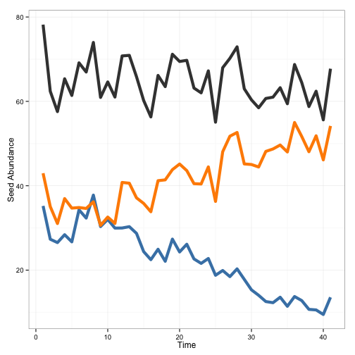
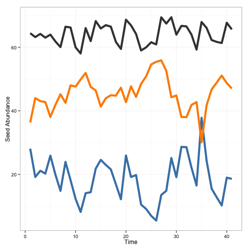
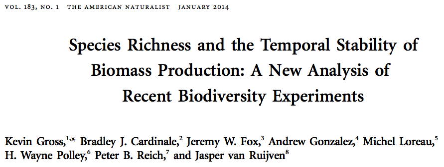
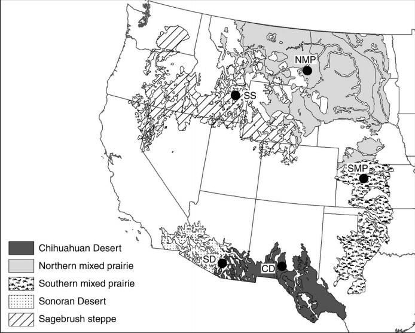
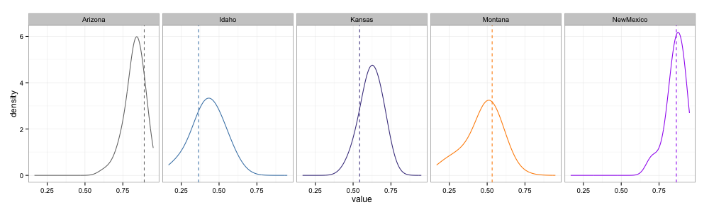
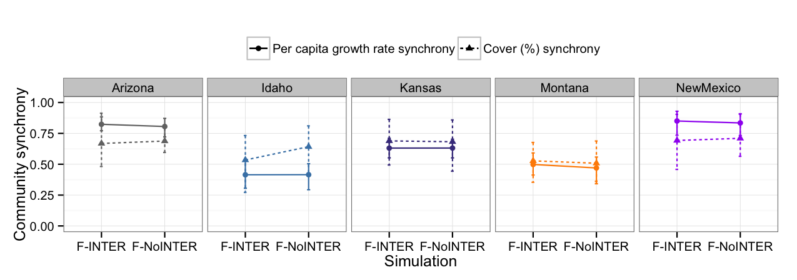
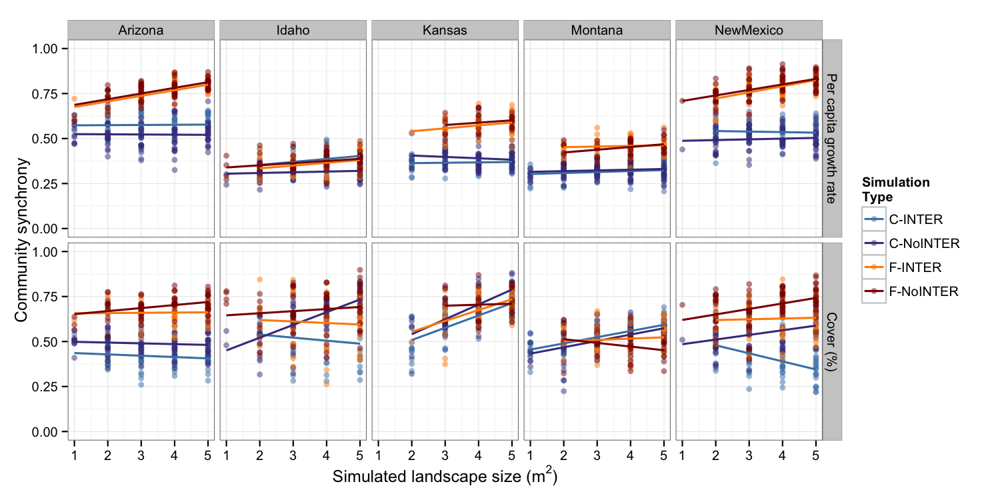

Environmental forcing synchronizes community dynamics...but not completely
========================================================
author: Andrew Tredennick, Claire de Mazancourt, Michel Loreau, and Peter Adler
date: 

Asynchrony is a stabilizing force
========================================================

 

***

 

How prevalent are asynchronous dynamics?
========================================
 
 

How prevalent are asynchronous dynamics?
========================================

***"In grasslands, compensatory dynamics among species promote community stability, regardless ofhow similarly or dissimilarly those species respond to the environment"***

What drives species synchrony?
==============================
**From Loreau and de Mazancourt 2008 (AmNat)**
* Demographic stochasticity, $\sigma_D$ ($\downarrow$)
* Environmental forcing, $\sigma_E$ ($\uparrow$)
* Interspecific interactions, $\sigma_C$ ($\uparrow$)

What drives species synchrony?
==============================
**Synchrony varies between 1/S and 1 or $\phi_E$**

 

$$
\phi_r = \frac{\sigma^{2}_{c} + \sigma^{2}_{e} + \sigma^{2}_{d}/(SN)}{[(1/S)(\sum_{i}\sqrt{\sigma^{2}_{c} + \sigma^{2}_{e} + \sigma^{2}_{d}/(N)})]^2}
$$

What drives species synchrony?
==============================
 
$\underbrace{\sigma^{2}_{c}+\sigma^{2}_{e}}_\text{spp. inter. & env.} >> \underbrace{\sigma^{2}_{d}/N_i}_\text{demog. stoch.}$ $\rightarrow$ $\phi_r \approx 1$ or $\phi_E$

$\underbrace{\sigma^{2}_{c}+\sigma^{2}_{e}}_\text{spp. inter. & env.} << \underbrace{\sigma^{2}_{d}/N_i}_\text{demog. stoch.}$ $\rightarrow$ $\phi_r \approx 1/S$

Objectives
==========
1. Calculate how (a)synchronous community dynamics are in natural grasslands
2. Disentangle the drivers of community synchrony

Data
====
**Demographic data from 5 semiarid grasslands**
 

Methods
=======
1. Population models
  * Environmentally stochastic integral projection model (IPM)
  * Environmentally and demographically stochastic individually based model (IBM)

2. Explore effects of...
  * Environmental responses (on/off)
  * Species interactions (on/off)
  * Demographic stochasticity (on/off and varying strength)
  
Results
=======
**Observed vs. modeled synchrony**
 
 

Results
=======
**No effect of interspecific interactions in large populations**
 

Results
=======
**Demographic stochasticity de-synchronizes dynamics a little bit**
 

Conclusion(s)
=============
1. Environmental responses synchronize community dynamics, but not completely
2. Temporal niche differences still exist to (or else synchrony = 1)
3. Interspecific interactions are weak, so no effect on synchrony

Are asynchronous (compensatory) dynamics rare?
==============================================
**NO!**
 
**We were just looking for them in the wrong place (abundances) and from the wrong starting point (independent fluctuations).**
